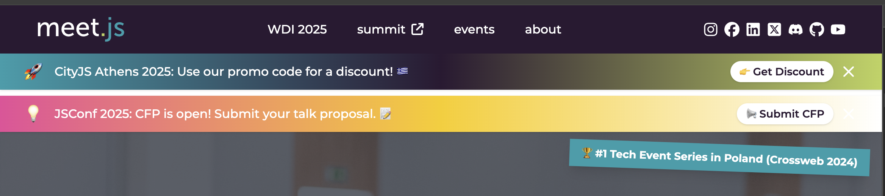

# Official [meet.js](https://meetjs.pl) website repository

Website for meet.js community.

## Stack

- [Next.js 15 (app router)](https://nextjs.org/docs)
- [React 19](https://react.dev/)
- [TypeScript](https://www.typescriptlang.org/docs)
- [Tailwindcss](https://tailwindcss.com/docs)

## Development

1. Clone the repository `git clone git@github.com:naugtur/meetjs.pl.git`
2. Enter the repository `cd meetjs.pl`
3. Install dependencies `pnpm install`
4. Setup env variables `cp .env.example .env`
5. Run development server `pnpm dev`
6. Open [http://localhost:3000](http://localhost:3000) in your browser

## Security

- For basic security all lifecycle scripts are disabled in .npmrc (also supported by pnpm) and in case the setting is not respected, `preinstall-always-fail` will error out to warn you.
- Socket.dev warnings on PRs are enabled for the repo.

## Promo Banners: How to Add or Edit a Promo

To add, edit, or remove promotional banners (e.g., for events or discounts), edit the file:

```
src/content/promos.ts
```

Below is an example of how multiple promo banners appear on the site:



Each promo is an object in the exported `promos` array. Example:

```ts
import { Promo } from '../components/PromoBanners';

export const promos: Promo[] = [
	{
		id: 'cityjs-athens-2025', // Unique string identifier
		message: 'CityJS Athens 2025: Use our promo code for a discount!', // Banner message
		cta: '👉 Get Discount', // Call-to-action text
		link: 'https://ti.to/cityjs-conference/cityjs-athens-2025/discount/meetjs', // Link for CTA
		expiresAt: '2025-12-31T23:59:59+02:00', // Expiry date (ISO format)
		gradient: 'bg-gradient-to-r from-blue via-purple to-green', // Optional Tailwind gradient class
		icon: '🚀', // Optional emoji or icon (left side)
		emojiRight: '🇬🇷', // Optional emoji (right side)
	},
	// Add more promos as needed
];
```

**Field descriptions:**

- `id` (string): Unique identifier for the promo (required)
- `message` (string): The text shown in the banner (required)
- `cta` (string): The call-to-action button text (required)
- `link` (string): URL for the CTA button (required)
- `expiresAt` (string): Expiration date/time in ISO 8601 format (required)
- `gradient` (string): Tailwind CSS gradient class for background (optional)
- `icon` (string): Emoji or icon on the left (optional)
- `emojiRight` (string): Emoji or icon on the right (optional)

**After editing promos.ts, save and reload the page to see your changes.**

## Brand Assets and Wallpapers

The website includes a dedicated section for brand assets and wallpapers that can be easily downloaded and used by the community.

You can access the brand assets page at:

```
https://meetjs.pl/brand
```

### Official Brand Assets Repository

The complete collection of meet.js brand assets is available in the official GitHub repository:

```
https://github.com/meetjspl/brand-assets
```

This repository contains:
- Multiple logo variants (SVG, PNG)
- Monochrome versions (black, white)
- Square logo variants
- Logos with tagline
- High-resolution print versions
- Wallpapers in various resolutions
- Social media assets

### Adding Assets to the Website

To add or update brand assets on the website:

1. Place new logo files in `public/brand/logos/`
2. Place new wallpaper files in `public/brand/wallpapers/`
3. Update the assets list in `src/app/brand/page.tsx`

Each asset should include:
- Name
- File path
- Description
- Dimensions (for wallpapers)
- File size

### Brand Colors

#### Current Colors (Post-2023)

The current official meet.js brand colors are:

- Purple: `#2B1932` / rgb(43, 25, 50) - Primary background color
- Green: `#BCD35D` / rgb(188, 211, 93) - Accent color for highlights and CTAs
- Blue: `#219EAB` / rgb(33, 158, 171) - Secondary accent color

#### Original Colors

The original meet.js brand colors were:

- Purple: `#2B1C34` / rgb(43, 28, 52) - Primary background color
- Green: `#BDDB59` / rgb(189, 219, 89) - Accent color for highlights and CTAs
- Blue: `#249FAB` / rgb(36, 159, 171) - Secondary accent color
