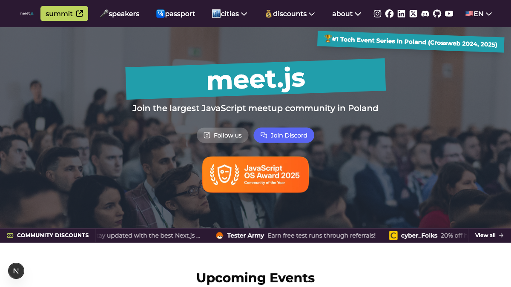
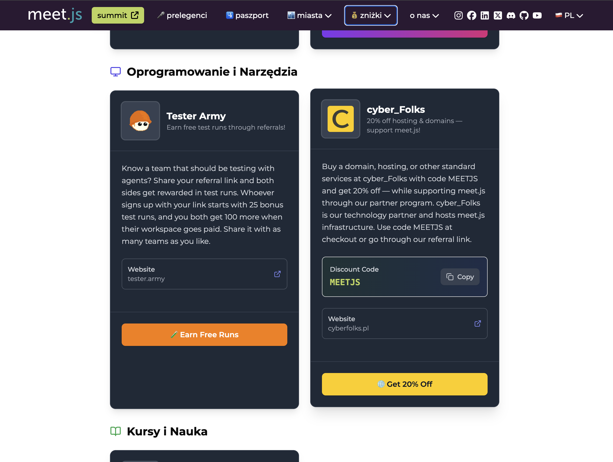

# Official [meet.js](https://meetjs.pl) website repository

Website for meet.js community.

## Stack

- [Next.js 16.3 (app router)](https://nextjs.org/docs)
- [React 19.2](https://react.dev/) with [React Compiler 1.0](https://react.dev/blog/2025/10/07/react-compiler-1)
- [TypeScript](https://www.typescriptlang.org/docs)
- [Tailwindcss](https://tailwindcss.com/docs)

## Development

1. Clone the repository `git clone git@github.com:naugtur/meetjs.pl.git`
2. Enter the repository `cd meetjs.pl`
3. Install dependencies `pnpm install`
4. Setup git hooks `pnpm prepare`
5. Setup env variables `cp .env.example .env`
6. Run development server `pnpm dev`
7. Open [http://localhost:3000](http://localhost:3000) in your browser

## Security

- For basic security all lifecycle scripts are disabled in .npmrc (also supported by pnpm) and in case the setting is not respected, `preinstall-always-fail` will error out to warn you.
- Socket.dev warnings on PRs are enabled for the repo.

## City Status Configuration

The meet.js community is present in multiple cities across Poland. Each city status can be configured in:

```
src/content/cities.tsx
```

City statuses include:

- **active**: Currently organizing meetups (Białystok, Bielsko-Biała, Gdańsk, Kraków, Łódź, Lublin, Poznań, Warszawa, Wrocław)
- **new**: Recently launched (Katowice)
- **coming-soon**: Planning to start meetups soon (none at the moment)
- **paused**: Temporarily inactive (Kielce, Szczecin, Toruń)

City pages that are not shown on the map (Gliwice, Olsztyn, Opole, Rzeszów, Zielona Góra) are listed in `UNMAPPED_CITY_PAGES` in the same file.

## Discounts & Special Offers: How to Add or Edit

To add, edit, or remove discount offers, edit the appropriate file:

- `src/content/events-discounts.ts` - Anything with a specific date: conferences, live workshops, meetups
- `src/content/software-discounts.ts` - Software tools
- `src/content/learning-discounts.ts` - Self-paced/evergreen content: online courses, learning platforms, newsletters

Rule of thumb: a scheduled live event (even an online workshop) goes to events; self-paced educational content goes to learning.

Active offers appear in the "Community Discounts" ticker on the homepage and as cards on the [`/discounts`](https://meetjs.pl/discounts) page. Offers disappear automatically after their `expiresAt` date.





Each discount is an object in the exported `eventsDiscounts`, `softwareDiscounts` or `learningDiscounts` array. Example entry:

```ts
import { Promo } from '@/types/promo';

export const eventsDiscounts: Promo[] = [
  {
    id: 'react-universe-2025', // Unique string identifier
    name: 'React Universe Conf 2025', // Display name
    message: 'React Universe Conf 2025: 10% off with code meet.js10!', // Short teaser
    cta: '👉 Get Discount', // Call-to-action text
    ticketLink: 'https://ti.to/RUC/react-universe-conf-2025/discount/meet.js10', // Link for CTA
    eventLink: 'https://react-universe.org', // Optional link to event website
    expiresAt: '2025-09-02T23:59:59+02:00', // Expiry date (ISO 8601)
    description:
      'React Universe is the largest React conference in Central Europe...', // Optional full description
    gradient: 'bg-gradient-to-r from-yellow-400 via-orange-500 to-pink-500', // Tailwind gradient classes
    icon: '🪐', // Optional emoji or icon
    emojiRight: '🇵🇱', // Optional emoji shown after the location
    country: 'Poland', // Optional event country
    city: 'Wrocław', // Optional event city
    discountCode: 'meet.js10', // Optional discount code
  },
  // Add more discounts as needed
];
```

**Field descriptions** (type `Promo` in `src/types/promo.ts`):

- `id` (string): Unique identifier for the discount (required)
- `name` (string): Display name shown in the ticker and on the card (required)
- `message` (string): Short teaser text (required)
- `cta` (string): The call-to-action button text (required)
- `ticketLink` (string): URL for the CTA button (required)
- `expiresAt` (string): Expiration date/time in ISO 8601 format; the offer is hidden afterwards (required)
- `gradient` (string): Tailwind gradient classes for the CTA button on software and learning cards (required)
- `description` (string): Longer description shown on the card (optional)
- `eventLink` (string): Link to the event website (optional)
- `country`, `city` (string): Event location shown on the card (optional)
- `icon` (string or React node): Emoji or image URL used as the offer icon (optional)
- `image` (string): Logo image URL or path; takes precedence over `icon` (optional)
- `emojiLeft` (string): Fallback icon in the ticker (optional)
- `emojiRight` (string): Emoji shown after the location, e.g. a flag (optional)
- `textColor` (string): Tailwind text color class for the CTA button (optional)
- `discountCode` (string): Discount code displayed with a copy button (optional)
- `workshopDescription`, `workshopLink`, `workshopDiscountCode` (string): Extra workshop block, shown when `workshopDescription` is set (optional)

Offers with `eventLink`, `country` or `city` are treated as events and listed first in the homepage ticker. Write Tailwind classes (e.g. `gradient`) as complete strings — Tailwind only generates classes it finds in the source files.

### Contact for Discounts

If you're organizing an event, conference, or offering software tools and would like to provide discounts to the meet.js community, please reach out to us at **contact@meetjs.pl**. We're always happy to feature relevant offers that benefit our developer community.

**After editing any of these discount files, save and reload the page to see your changes.**

## Community Participation Section

The website features a dedicated Community Participation section that showcases surveys, research initiatives, and collaborative projects that benefit the JavaScript community. This section appears on the homepage (below the Join Us section and the YouTube banner, above About), and all items are listed on the [`/community`](https://meetjs.pl/community) page.

### Configuration

Community participation items are configured in:

```
src/content/communityParticipation.ts
```

### Card Types

The system supports multiple types of community participation cards:

#### Current Types:

- **survey** 📊 (Blue theme) - Developer surveys, community polls, feedback collection
- **initiative** 🤝 (Green theme) - Community projects, open source initiatives, volunteer programs
- **research** 🔬 (Purple theme) - Academic studies, industry research, data collection
- **collaboration** 🤝 (Orange theme) - Partnership opportunities, joint projects, community building

#### Potential Additional Types:

- **event** 🎪 (Red theme) - Hackathons, conferences, special meetups, workshops
- **learning** 📚 (Indigo theme) - Free courses, tutorials, certification programs, mentorship
- **contest** 🏆 (Yellow theme) - Coding competitions, design contests, innovation challenges
- **feedback** 💬 (Teal theme) - Beta testing, product feedback, community input requests
- **volunteer** 🙋 (Pink theme) - Conference organizing, mentoring, content creation
- **sponsorship** 💼 (Gray theme) - Sponsor opportunities, partnership calls, funding requests

### Adding Community Items

Each community item is an object in the `COMMUNITY_PARTICIPATION` array:

```typescript
{
  id: 'state-of-js-2025',
  title: 'State of JS 2025 Survey',
  description: 'Help shape the future of JavaScript by sharing your experience with the latest tools, frameworks, and trends in the JS ecosystem.',
  url: 'https://survey.devographics.com/en-US/survey/state-of-js/2025',
  type: 'survey',
  status: 'active',
  startDate: '2025-01-01',
  endDate: '2025-02-28',
  organization: 'Devographics',
  impact: 'Your input helps developers worldwide understand JS trends and make informed technology decisions.',
  ctaText: 'Take the Survey',
  featured: true,
  tags: ['JavaScript', 'Survey', 'Community', 'Trends', 'Ecosystem']
}
```

### Field Descriptions

- `id` (string): Unique identifier for the item (required)
- `title` (string): Display title for the card (required)
- `description` (string): Main description text (required)
- `url` (string): External link for the call-to-action (required)
- `type` (string): Card type - determines icon and color theme (required)
- `status` (string): 'active', 'upcoming', or 'completed' (required)
- `startDate` (string): Start date in YYYY-MM-DD format (optional)
- `endDate` (string): End date in YYYY-MM-DD format (optional)
- `organization` (string): Organization or entity behind the initiative (required)
- `impact` (string): Description of the impact or benefit (required)
- `ctaText` (string): Call-to-action button text (required)
- `featured` (boolean): Whether to display on homepage (optional, default: false)
- `tags` (string[]): Array of relevant tags for categorization (required)
- `image` (string): Logo or image URL shown on the card; remote hosts must be allowed in `images.remotePatterns` in `next.config.ts` (optional)
- `pinned` (boolean): Always list the item before others (optional)

### Display Logic

- The homepage shows up to 3 items with `featured: true` whose `endDate` hasn't passed (`status` is not checked), sorted by newest `startDate` with `pinned` items first
- The homepage section automatically hides when no such items exist
- The `/community` page lists all items, including completed ones
- Cards are responsive and center-aligned in a grid layout
- Dark mode styling is fully supported

### Contact for Community Initiatives

If you're organizing surveys, research projects, or community initiatives that would benefit JavaScript developers, please reach out to us at **contact@meetjs.pl**. We're always interested in featuring valuable community participation opportunities.

## Brand Assets and Wallpapers

The website includes a dedicated section for brand assets and wallpapers that can be easily downloaded and used by the community.

You can access the brand assets page at:

```
https://meetjs.pl/brand
```

### Official Brand Assets Repository

The complete collection of meet.js brand assets is available in the official GitHub repository:

```
https://github.com/meetjspl/brand-assets
```

This repository contains:

- Multiple logo variants (SVG, PNG)
- Monochrome versions (black, white)
- Square logo variants
- Logos with tagline
- High-resolution print versions
- Wallpapers in various resolutions
- Social media assets

### Adding Assets to the Website

To add or update brand assets on the website:

1. Place new logo files in `public/assets/brand/logo/` (pre-2023 assets live in `public/assets/brand/pre-2023/`)
2. Place new wallpaper files in `public/brand/wallpapers/`
3. Add an entry to the matching list in `src/app/brand/page.tsx` (`officialLogos`, `boldLogos`, `legacyLogos` or `wallpapers`)

Each entry (`AssetItem`) has:

- `name`
- `path` (public URL, e.g. `/assets/brand/logo/bold/meetjs_logo_color_bold.svg`)
- `description` (optional)
- `dimensions` (optional, used for wallpapers)
- `fileSize` (optional)

### Brand Colors

#### Current Colors (Post-2023)

The current official meet.js brand colors are:

- Purple: `#2B1932` / rgb(43, 25, 50) - Primary background color
- Green: `#BCD35D` / rgb(188, 211, 93) - Accent color for highlights and CTAs
- Blue: `#219EAB` / rgb(33, 158, 171) - Secondary accent color

#### Original Colors

The original meet.js brand colors were:

- Purple: `#2B1C34` / rgb(43, 28, 52) - Primary background color
- Green: `#BDDB59` / rgb(189, 219, 89) - Accent color for highlights and CTAs
- Blue: `#249FAB` / rgb(36, 159, 171) - Secondary accent color

## Internationalization (i18n) with Tolgee

This project uses [Tolgee](https://tolgee.io) for internationalization, supporting English (`en`) and Polish (`pl`) languages.

The app works without a Tolgee API key: translations are bundled from `messages/en.json` and `messages/pl.json`. An API key is only needed for live translations and in-context editing during development.

### Setup

1. **Create a Tolgee account** at [https://app.tolgee.io](https://app.tolgee.io)
2. **Create a new project** in your Tolgee dashboard
3. **Get your API key** from the project settings
4. **Add environment variables** to your `.env` or `.env.development.local`:
   ```bash
   NEXT_PUBLIC_TOLGEE_API_KEY=your_actual_api_key_here
   NEXT_PUBLIC_TOLGEE_API_URL=https://app.tolgee.io
   ```

The Tolgee CLI configuration (`.tolgeerc`) points at the meet.js project (`projectId: 20172`); update it if you use your own project.

### Initial Translation Setup (new Tolgee project)

1. **Upload translation files** to your Tolgee project:
   - Import `messages/en.json` for English translations
   - Import `messages/pl.json` for Polish translations
   - Use the Tolgee dashboard's import feature

2. **Configure languages** in your Tolgee project:
   - Set English (`en`) as the base language
   - Add Polish (`pl`) as a target language

### Using Translations in Components

**Server Components:**

```tsx
import { getTranslate } from '@/tolgee/server';

export default async function MyComponent() {
  const t = await getTranslate();

  return (
    <div>
      <h1>{t('hero.title')}</h1>
      <p>{t('hero.subtitle')}</p>
    </div>
  );
}
```

**Client Components:**

```tsx
'use client';
import { useTranslate } from '@tolgee/react';

export default function MyClientComponent() {
  const { t } = useTranslate();

  return (
    <div>
      <h1>{t('navigation.home')}</h1>
      <button>{t('hero.cta')}</button>
    </div>
  );
}
```

### Translation Keys Structure

Translation keys are organized by sections:

```json
{
  "navigation": {
    "home": "Home",
    "events": "Events",
    "about": "About",
    "discounts": "Discounts",
    "team": "Team",
    "sponsors": "Sponsors"
  },
  "hero": {
    "title": "meet.js",
    "subtitle": "Join the largest JavaScript meetup community in Poland",
    "cta": "Find Your Local Meetup"
  },
  "footer": {
    "copyright": "All rights reserved.",
    "contact": "Contact us"
  }
}
```

### In-Context Translation

With Tolgee's in-context translation feature (works in development when `NEXT_PUBLIC_TOLGEE_API_KEY` is set):

1. **Hold Alt** and **click on any translated text** to edit it directly
2. Changes are saved to your Tolgee project automatically
3. Perfect for content managers and translators

### Testing Translations

Switch languages with the language switcher (🇺🇸 EN / 🇵🇱 PL) in the navigation. The choice is stored in the `NEXT_LOCALE` cookie; without it, the language is detected from the browser's `Accept-Language` header (default: English). Both languages use the same URLs.

### Translation Workflow

1. **Developers**: Add translation keys using `t('key.name')` in components and add them to both `messages/en.json` and `messages/pl.json`
2. **Content Team**: Use Tolgee dashboard or in-context editing to manage translations
3. **Translators**: Use Tolgee's translation interface for Polish translations
4. **Deployment**: Production uses the bundled `messages/*.json` files, so run `pnpm tolgee:pull` and commit the result to ship translation changes

Tolgee CLI commands:

- `pnpm tolgee:pull` - Download translations into `messages/`
- `pnpm tolgee:push` - Upload `messages/en.json` (only English is pushed)
- `pnpm tolgee:sync` - Sync keys used in `src/` with the Tolgee project

The CLI needs `TOLGEE_API_KEY` in CI; locally, log in with `pnpm tolgee login <your_api_key>`.

### Configuration Files

- `src/tolgee/shared.ts` - Base Tolgee configuration
- `src/tolgee/server.tsx` - Server-side Tolgee instance
- `src/tolgee/client.tsx` - Client-side Tolgee provider
- `src/tolgee/language.ts` - Language detection (cookie, `Accept-Language`) and the `setLanguage` server action
- `messages/en.json` - English translations (bundled into the app, synced with Tolgee)
- `messages/pl.json` - Polish translations (bundled into the app, synced with Tolgee)
- `.tolgeerc` - Tolgee CLI configuration
